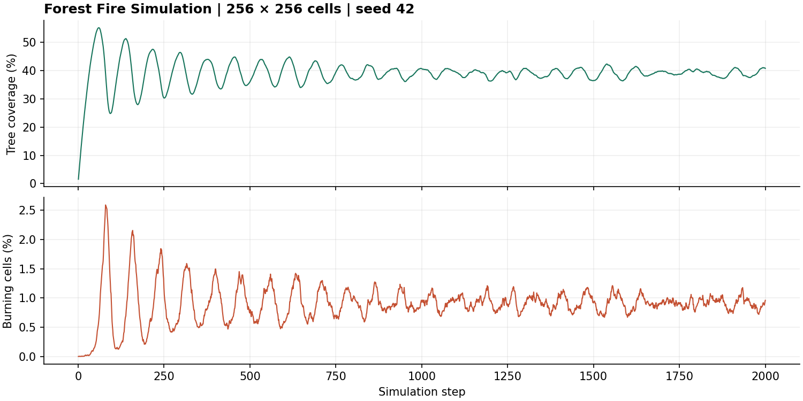

# Forest Fire Simulation

A stochastic forest-fire model written in Python. Trees grow, ignite and burn on a periodic grid; the competition between growth and lightning produces oscillations, broad fire-size distributions and changing cluster geometry.

The project received **74% — a First-Class mark**. I extended the original coursework with larger simulations, parameter sweeps, fire tracking and an interactive demonstration.

[Interactive simulation](https://forest-fire-analysis.streamlit.app/) · [Forest Fire Simulation report](https://1drv.ms/b/c/4a8cd531de3d2eb8/IQDim1tykc0nTKl1fFVf2T52AaR-wLgcwbBSEvPdq3rfR-U?e=Kbm6k0) · [Methods and limitations](docs/methods.md) · [Tests](https://github.com/Robert-Study/Forest-Fire-Analysis/actions)

## A reproducible example



*256 × 256 cells, 2,000 steps, p = 0.0153, f = 0.000153, seed 42. The two panels use separate vertical scales. This plot is generated by `python demo.py`.*

The [saved run metadata](assets/run.json) records the requested and effective probabilities, Python and NumPy versions, and the timing scope. This small example contains **131,072,000 cell-time updates**. Its timing is a measurement of this run and environment, not a prediction for larger grids.

## Run it

Use Python 3.12:

```bash
git clone https://github.com/Robert-Study/Forest-Fire-Analysis.git
cd Forest-Fire-Analysis
python -m venv .venv
```

Activate with `source .venv/bin/activate` on macOS/Linux, or `.venv\Scripts\Activate.ps1` in Windows PowerShell. Then:

```bash
python -m pip install -r requirements.txt
python demo.py
```

The example saves `population.csv`, `population.png` and `run.json` under `outputs/demo/`. To change the experiment or open the interactive version:

```bash
python demo.py --size 128 --frames 1000 --p 0.02 --f 0.0002 --seed 7
python -m streamlit run Streamlit_Simulation.py
python -m unittest discover -s tests -v
```

## The model

Each cell is empty, a tree or burning. Updates are synchronous:

1. Burning cells become empty.
2. Trees next to a burning cell ignite; lightning can ignite other trees with probability f.
3. Cells that were empty at the start of the step grow a tree with probability p.

Fire spreads through the four nearest neighbours. Both grid axes wrap, so edge cells follow the same neighbourhood rule as interior cells.

The core uses NumPy arrays, a `uint8` state grid and integer probability draws. The default is 32-bit probability precision. A 16-bit mode is available for comparison; probabilities below its resolution are rejected rather than silently becoming zero. CSV rows and optional GIF frames are written as the run progresses.

## What I investigated

- **Population dynamics:** fitting a decaying sinusoid to tree coverage and comparing it with the burning population.
- **Parameter dependence:** sweeping growth and ignition probabilities to study changes in fitted equilibrium coverage, frequency and damping.
- **Fire-size distributions:** following individual ignition lineages and comparing pure and truncated power-law fits.
- **Cluster geometry:** measuring the area and exposed perimeter of surviving tree clusters.

The report describes simulations reaching **16,000 × 16,000 cells over 8,000 steps**: **2.048 trillion cell-time updates**. This counts lattice cells multiplied by steps; it is not a count of CPU instructions or independent experiments. The report's working-memory estimate belongs to that historical implementation. It is not a peak-memory measurement of the current code.

## Interpreting the results

The model was developed to investigate self-organised criticality. Reaching a steady population or obtaining a high R² on a log-log plot does not, by itself, establish criticality or identify a unique heavy-tail model.

The current count fits are exploratory least-squares fits. The transient cutoff is an empirical sampling rule from an earlier parameter sweep. Both need further checks before drawing general conclusions across grid sizes or parameter ranges.

The fire tracker records complete ignition lineages and excludes events still active when a run ends. A collision assigns the shared cell to the oldest neighbouring lineage. That convention matters when interpreting event sizes. The interactive plot now retains events larger than the grid width: event size is a count of burned cells, not a linear distance.

## Code layout

- `forest_fire/core_simulations/` — shared updates, population runs and event tracking.
- `forest_fire/analysis/` — fitting, parameter sweeps, sampling and cluster measurements.
- `forest_fire/display/` — plotting helpers.
- `demo.py` — the small seeded example above.
- `Streamlit_Simulation.py` — interactive controls and visualisation.
- `tests/` — periodic boundaries, synchronous updates, probability precision and event accounting.

The Python package is named `forest_fire` to avoid clashing with Python's standard `code` module. Older imports beginning `from code...` should use `from forest_fire...`.

The report is the assessed submission. The current code and tests include subsequent corrections; historical fitted results have not been recomputed from the original large runs.
