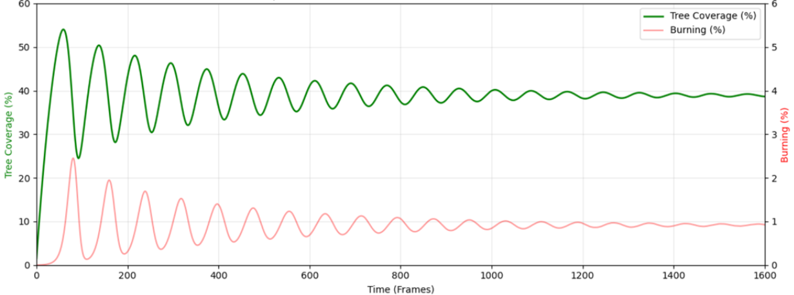
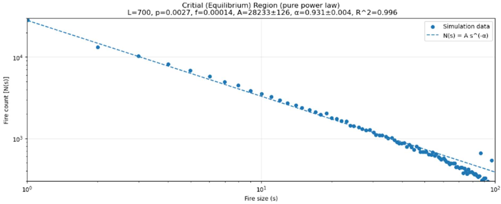
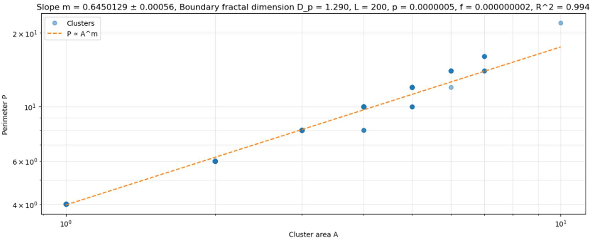

# Forest Fire Simulation

A stochastic forest-fire cellular automaton exploring **population oscillations, fire-size distributions and cluster geometry**. I extended the assessed coursework with larger simulations, parameter sweeps, fire tracking and an interactive application.

**74% | First Class**

[Interactive simulation](https://forest-fire-analysis.streamlit.app/) · [Read the project report](https://1drv.ms/b/c/4a8cd531de3d2eb8/IQDim1tykc0nTKl1fFVf2T52AaR-wLgcwbBSEvPdq3rfR-U?e=Kbm6k0)

## Results

**2 trillion+ cell-time updates per large simulation · 15 trillion+ across the project**



*Original population-dynamics figure, with p = 0.0153 and f = 0.000153. The displayed time window is 0–1,600 frames.*

When growth dominates over lightning, connected forests build up before large fires disrupt them. Repeated growth and destruction produce damped population oscillations. I fitted a decaying sinusoid to estimate equilibrium coverage, oscillation frequency and decay rate, then examined how these changed with growth and ignition probabilities.

The larger simulations required vectorised NumPy operations, compact arrays, attention to temporary memory and incremental output. A 16,000² × 8,000 run contains 2.048 trillion cell-time updates, counting cells multiplied by timesteps.

## The model

Each cell is empty, a tree or burning. Updates are synchronous: burning cells become empty, fire spreads to neighbouring trees, lightning ignites other trees with probability f, and previously empty cells grow trees with probability p.

**The grid wraps in both directions.** Fire crossing the top edge continues at the bottom, and fire crossing the left edge continues at the right. Four-neighbour connectivity and periodic boundaries apply to the simulation and tree-cluster analysis.

## Methods

### Population dynamics and sampling

The tree population is fitted with a decaying sinusoid to estimate equilibrium coverage, frequency and damping. Parameter sweeps examine how these fitted quantities vary with growth and lightning probabilities.

The sampling rule uses `D(f) = A f^B`, with fitted values `A = 0.061399940272506136` and `B = 0.3081816633412444`. Its thresholds correspond to the fitted oscillation envelope falling to 10% and 0.1% of its initial amplitude.

These constants came from an earlier parameter sweep. The function named `critical_regime_start` is retained for compatibility, but gives an empirical transient cutoff rather than a test of criticality. Population traces, fit residuals, independent seeds, lattice sizes and sensitivity to the sampling window all matter when interpreting scaling.

### Fire events and size distributions

Every lightning ignition starts an identified lineage. If an existing fire reaches a tree in the same update, spread takes precedence over a new lightning ID. When several lineages reach a tree, the oldest neighbouring ID receives the cell; lineages do not merge.

Event size sums the burning cells assigned to a lineage over its lifetime. Events are grouped by ignition time and counted after they finish. Events still burning at the final frame are excluded as incomplete. Finite observation windows can nevertheless underrepresent long-lived events.

An event can burn more cells than the grid's linear width, and the app retains these large events. Regrowth also means an event can revisit a site, so its total size differs from its number of unique burned sites.



*Fire-size analysis from the assessed report.*

Pure and truncated power-law fits use least squares on observed counts. Count uncertainty varies, observations can be correlated, and the fitted range affects the result. R² and local covariance errors do not establish that a power law is preferred to another distribution or that the system is critical.

Further analysis could use discrete maximum-likelihood fits, cutoff selection, goodness-of-fit checks, comparisons with other heavy-tail models and uncertainties across independent runs. The historical large-run figures have not been recomputed after the event-accounting corrections.

### Cluster geometry

Tree clusters use four-neighbour connectivity with periodic boundaries. Area counts tree sites; perimeter counts edges bordering any non-tree state.



*Area–perimeter analysis from the report.*

If area scales as `R^D` and perimeter as `R^Dp`, the area–perimeter slope m gives `m = Dp/D`. The conversion `Dp = 2m` additionally assumes compact area scaling with D = 2. Radius-of-gyration measurements and a broader scaling range would help check that assumption.

The interactive app measures the perimeter of the union of sites burned by an event. That is a different geometric object from a surviving tree cluster.

### Probability precision and memory

For a b-bit integer draw, the effective probability is `floor(p × 2^b) / 2^b`. The core defaults to 32 bits, with resolution approximately 2.33 × 10⁻¹⁰. The optional 16-bit mode has resolution approximately 1.53 × 10⁻⁵. Positive probabilities below the chosen resolution are rejected.

A fixed seed reproduces a trajectory for the same implementation, random generator and precision. Changing bit depth changes the random draws and trajectory. The small command-line run records effective probabilities and environment versions alongside its results.

The historical working-memory estimate of approximately 9.5 bytes per cell belongs to that implementation. It is not a measured peak resident-set size for the current code. NumPy Boolean masks use one byte per cell, and temporary arrays contribute to peak memory.

## Code and core tests

| Folder | Contents |
| --- | --- |
| `forest_fire/` | Simulation engines, analysis, plotting, the Streamlit application and a small command-line run |
| `tests/` | Periodic boundaries, synchronous updates, probability precision, event accounting and application startup |
| `.github/` | Automated checks |

The top-level `Streamlit_Simulation.py` launches the application for the existing public deployment.

```bash
python -m pip install -r requirements.txt
python -m streamlit run Streamlit_Simulation.py
python -m unittest discover -s tests -v
```

[Core tests](tests/test_core.py) · [Simulation tests](tests/test_simulation.py) · [GitHub Actions](https://github.com/Robert-Study/Forest-Fire-Analysis/actions)

**Tools:** Python, NumPy, SciPy, Matplotlib and Streamlit.
