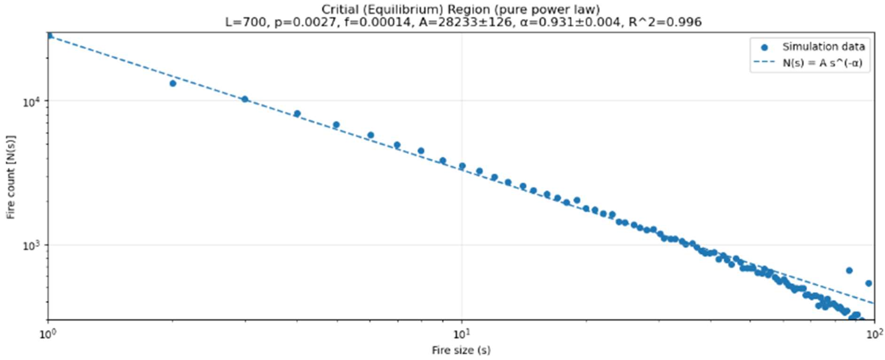
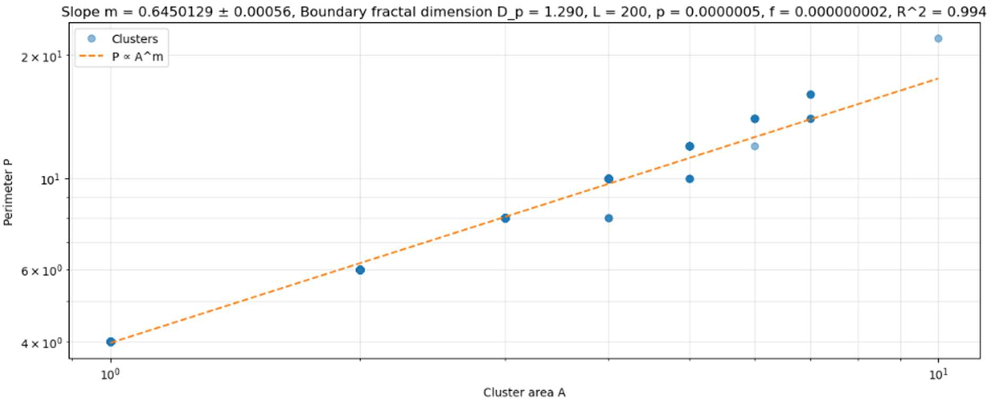

# Forest Fire Simulation & Analysis

A high-performance Python implementation of a stochastic forest-fire cellular automaton, developed to investigate **self-organised criticality, transient population oscillations, fire-size statistics and cluster geometry**.

The project began as assessed university coursework and received a **74% First-Class mark**. The public repository has since been extended with larger simulations, reusable parameter sweeps, additional statistical analysis, memory-conscious output handling and an interactive Streamlit demonstration.

**[Interactive Streamlit Demo](https://forest-fire-analysis.streamlit.app/)** · **[Technical Report](https://1drv.ms/b/c/4a8cd531de3d2eb8/IQDim1tykc0nTKl1fFVf2T52AaR-wLgcwbBSEvPdq3rfR-U?e=Kbm6k0)**

---

## Example Result

### Rainforest - Good Growth Conditions and Average Storm Activity

**Simulation parameters:** `p = 0.0153` · `f = 0.000153` · `f/p = 0.01` · `L = 16,000` (`256 million cells`)

<p align="center">
  
</p>

<p align="center">
  <em>Figure 1. Tree coverage and burning population through time. Large fire events produce pronounced damped oscillations before the system approaches a statistically steady regime.</em>
</p>

When tree growth strongly dominates lightning, dense connected forests form before being disrupted by large outbreaks. Repeated cycles of growth and destruction generate the damped oscillations above. A decaying-sine fit provides estimates of the equilibrium coverage, oscillation frequency and exponential decay rate.

## Key Quantitative Results

The following results are taken from the assessed investigation. They are representative fitted results rather than universal constants of the model.

| Analysis | Representative result | Conditions |
| --- | --- | --- |
| Equilibrium coverage | `C ∝ p^0.08` and `C ∝ f^-0.20` | Five-point log-log sweeps; `R² = 0.99` and `0.98` |
| Oscillation decay | `D ∝ f^0.40` | Five-point lightning sweep; `R² = 1.00` |
| Critical-regime fire sizes | `α = 0.931 ± 0.004` | `L = 700`, `p = 0.0027`, `f = 0.00014`; binned fit `R² = 0.996` |
| Cluster boundary scaling | `P ∝ A^(0.6450 ± 0.0006)` | `L = 200`, `p = 5×10^-7`, `f = 2×10^-9`; boundary dimension `D_p = 1.290`, `R² = 0.994` |

---

## Quick Start

From a terminal:

```bash
git clone https://github.com/Robert-Study/Forest-Fire-Analysis.git
cd Forest-Fire-Analysis
python -m venv .venv
source .venv/bin/activate
python -m pip install -r requirements.txt
python -m streamlit run Streamlit_Simulation.py
```

On Windows, activate the environment with `.venv\Scripts\activate`.

The Streamlit application is designed for interactive demonstrations. The largest offline simulations require substantially more memory and runtime.

Run the lightweight validation suite with:

```bash
python -m unittest discover -s tests
```

---

## Model

Each cell on an `L × L` grid is either **empty**, **occupied by a tree**, or **burning**. At every timestep:

- an empty cell grows a tree with probability `p`;
- a tree ignites spontaneously with probability `f`;
- fire spreads to each orthogonally neighbouring tree; and
- a burning cell becomes empty after one frame.

The simulation uses **periodic boundary conditions**, so fire can wrap across the grid edges and boundary cells remain statistically equivalent to cells in the interior.

Despite these local rules, the model produces large-scale oscillations, statistically steady populations, heavy-tailed fire sizes and non-trivial spatial scaling.

---

## Analysis

### Population Dynamics

Tree coverage and burning fraction are tracked through time. The transient population is fitted with

```text
y(t) = C + A exp(-Dt) sin(ωt + φ),
```

where `C` is the equilibrium coverage, `A` the initial amplitude, `D` the decay rate, `ω` the angular frequency and `φ` the phase. The assessed simulations also exhibited an approximately `π/2` phase lag between the tree and burning populations, consistent with the delay between forest build-up and subsequent outbreaks.

Five-point log-log sweeps were used to explore how fitted observables vary with `p` and `f`. Characteristic times based on the fitted decay rate separate the strongly oscillatory transient from the later sampling region.

### Fire-Size Distributions

Each lightning ignition is assigned a fire identifier, allowing the number of burning cells associated with an event to be accumulated through time. For growth-dominated regimes, the binned event counts were modelled with

```text
N(s) ∝ s^(-α).
```

<p align="center">
  
</p>

<p align="center">
  <em>Figure 2. Representative critical-region fit: α = 0.931 ± 0.004 for L = 700, p = 0.0027 and f = 0.00014.</em>
</p>

When lightning is more significant relative to growth, the largest events are suppressed. This was explored using the truncated model

```text
N(s) = A s^(-α) exp(-s/s_c),
```

where `s_c` is the characteristic cutoff scale.

These least-squares fits describe binned simulation counts. Their covariance errors and `R²` values quantify fit precision within that procedure; they do not by themselves establish that a power law is the uniquely preferred statistical model.

### Cluster Geometry

Surviving tree clusters are identified using four-neighbour connectivity with the same periodic boundaries as the simulation. Cluster area is the number of occupied cells, while perimeter is the number of exposed cell edges.

<p align="center">
  
</p>

<p align="center">
  <em>Figure 3. Representative area-perimeter fit. The measured slope m = 0.6450 ± 0.0006 corresponds to a boundary dimension D_p = 2m = 1.290.</em>
</p>

---

## Performance & Optimisation

The main simulation loop uses NumPy array operations rather than cell-by-cell Python loops. Its principal optimisations include:

- `uint8` board storage and Boolean state masks;
- vectorised four-neighbour propagation using `np.roll`;
- compact integer probability grids;
- incremental CSV output;
- streaming GIF generation rather than retaining every RGB frame; and
- reusable geometrically spaced parameter sweeps.

| Property | Largest investigated scale |
| --- | ---: |
| Grid width | **16,000 cells** |
| Cells per frame | **256 million** |
| Run length | **up to 8,000 frames** |
| Cell-time updates | **2.048 trillion per run** |

The assessed implementation estimated its working-array overhead at approximately **9.5 bytes per cell**. A typical parameter study used a **5 × 5** grid of `p` and `f` combinations spanning roughly a **100× range**.

---

## Repository Structure

```text
Forest-Fire-Analysis/
├── assets/                       # README figures from the assessed report
├── code/
│   ├── core_simulations/         # Cellular-automaton simulation engines
│   ├── analysis/                 # Statistical analysis and fitting
│   ├── display/                  # Plotting and visualisation
│   └── results/                  # Output helper modules
├── tests/                        # Lightweight regression tests
├── Streamlit_Simulation.py       # Interactive demonstration
├── requirements.txt
└── README.md
```

---

## Limitations and Future Work

The current heavy-tail analysis uses binned least-squares fits and should be interpreted as exploratory. Natural extensions include:

- CCDF-based fire-size analysis with maximum-likelihood parameter estimates;
- formal comparison of power-law, truncated-power-law and lognormal alternatives;
- bootstrap confidence intervals and finite-size analysis;
- radius-of-gyration scaling and an independent cluster fractal dimension; and
- benchmarked runtime and peak-memory scaling across grid sizes.

---

## Technologies

`Python` · `NumPy` · `SciPy` · `Pandas` · `Matplotlib` · `Streamlit` · `tqdm` · `imageio`

**Methods:** cellular automata · numerical simulation · nonlinear fitting · parameter sweeps · power-law analysis · scientific visualisation · performance optimisation
